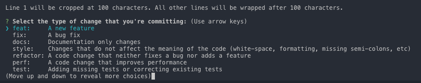

# Git 的奇技淫巧:see_no_evil:

> Git 常用命令集合，Fork 自 [tips](https://github.com/git-tips/tips) 项目

Git 是一个分布式版本管理工具，版本管理工具就是大家在写东西的时候都用过 **回撤**这个功能，但是回撤只能回撤几步，假如想要找回我三天之前的修改，光用回撤是找不回来的。而**版本管理工具能记录每次的修改**，只要提交到版本仓库，就可以找到之前任何时刻的状态（文本状态）。

下面的内容就是列举了常用的 Git 命令和一些小技巧，可以通过页面内查找的方式 `Ctrl/Command+f` 进行快速查找。

## 开卷必读

*如果之前未使用过 Git，可以学习 [Git 小白教程](https://rogerdudler.github.io/git-guide/index.zh.html)入门*

1. **一定要先测试命令的效果后**，再用于工作环境中，以防造成不能弥补的后果！**到时候别拿着砍刀来找我**
2. 所有的命令都在 `git version 2.7.4 (Apple Git-66)` 下测试通过
3. 统一概念：
	- 工作区：改动（增删文件和内容）
	- 暂存区：输入命令：`git add 改动的文件名`，此次改动就放到了 ‘暂存区’
	- 本地仓库(简称：本地)：输入命令：`git commit 此次修改的描述`，此次改动就放到了本地仓库，每个 commit，我叫它为一个版本。
	- 远程仓库(简称：远程)：输入命令：`git push 远程仓库`，此次改动就放到了远程仓库（GitHub 等)
	- commit-id：输出命令：`git log`，最上面那行 `commit xxxxxx`，后面的字符串就是 commit-id
4. 如果喜欢这个项目，欢迎 Star、提交 Pr、[反馈问题](https://github.com/521xueweihan/git-tips/issues)😊

## 目录
* [脑图](#脑图)
* [展示帮助信息](#展示帮助信息)
* [回到远程仓库的状态](#回到远程仓库的状态)
* [重设第一个commit](#重设第一个-commit)
* [查看冲突文件列表](#查看冲突文件列表)
* [展示工作区和暂存区的不同](#展示工作区和暂存区的不同)
* [展示暂存区和最近版本的不同](#展示暂存区和最近版本的不同)
* [展示暂存区、工作区和最近版本的不同](#展示暂存区工作区和最近版本的不同)
* [快速切换到上一个分支](#快速切换到上一个分支)
* [删除已经合并到 master 的分支](#删除已经合并到-master-的分支)
* [展示本地分支关联远程仓库的情况](#展示本地分支关联远程仓库的情况)
* [关联远程分支](#关联远程分支)
* [列出所有远程分支](#列出所有远程分支)
* [列出本地和远程分支](#列出本地和远程分支)
* [查看远程分支和本地分支的对应关系](#查看远程分支和本地分支的对应关系)
* [远程删除了分支本地也想删除](#远程删除了分支本地也想删除)
* [创建并切换到本地分支](#创建并切换到本地分支)
* [从远程分支中创建并切换到本地分支](#从远程分支中创建并切换到本地分支)
* [删除本地分支](#删除本地分支)
* [删除远程分支](#删除远程分支)
* [重命名本地分支](#重命名本地分支)
* [查看标签](#查看标签)
* [查看标签详细信息](#查看标签详细信息)
* [本地创建标签](#本地创建标签)
* [推送标签到远程仓库](#推送标签到远程仓库)
* [删除本地标签](#删除本地标签)
* [删除远程标签](#删除远程标签)
* [切回到某个标签](#切回到某个标签)
* [放弃工作区的修改](#放弃工作区的修改)
* [恢复删除的文件](#恢复删除的文件)
* [以新增一个 commit 的方式还原某一个 commit 的修改](#以新增一个-commit-的方式还原某一个-commit-的修改)
* [回到某个 commit 的状态，并删除后面的 commit](#回到某个-commit-的状态并删除后面的-commit)
* [修改上一个 commit 的描述](#修改上一个-commit-的描述)
* [查看 commit 历史](#查看-commit-历史)
* [显示本地更新过 HEAD 的 git 命令记录](#显示本地更新过-head-的-git-命令记录)
* [修改作者名](#修改作者名)
* [修改远程仓库的 url](#修改远程仓库的-url)
* [增加远程仓库](#增加远程仓库)
* [列出所有远程仓库](#列出所有远程仓库)
* [查看两个星期内的改动](#查看两个星期内的改动)
* [把 A 分支的某一个 commit，放到 B 分支上](#把-A-分支的某一个-commit放到-B-分支上)
* [给 git 命令起别名](#给-git-命令起别名)
* [存储当前的修改，但不用提交 commit](#存储当前的修改但不用提交-commit)
* [保存当前状态，包括 untracked 的文件](#保存当前状态包括-untracked-的文件)
* [展示所有 stashes](#展示所有-stashes)
* [回到某个 stash 的状态](#回到某个-stash-的状态)
* [回到最后一个 stash 的状态，并删除这个 stash](#回到最后一个-stash-的状态并删除这个-stash)
* [删除所有的 stash](#删除所有的-stash)
* [从 stash 中拿出某个文件的修改](#从-stash-中拿出某个文件的修改)
* [展示所有 tracked 的文件](#展示所有-tracked-的文件)
* [展示所有 untracked 的文件](#展示所有-untracked-的文件)
* [展示所有忽略的文件](#展示所有忽略的文件)
* [强制删除 untracked 的文件](#强制删除-untracked-的文件)
* [强制删除 untracked 的目录](#强制删除-untracked-的目录)
* [展示简化的 commit 历史](#展示简化的-commit-历史)
* [查看某段代码是谁写的](#查看某段代码是谁写的)
* [把某一个分支导出成一个文件](#把某一个分支导出成一个文件)
* [从包中导入分支](#从包中导入分支)
* [执行 rebase 之前自动 stash](#执行-rebase-之前自动-stash)
* [从远程仓库根据 ID，拉下某一状态，到本地分支](#从远程仓库根据-ID-拉下某一状态-到本地分支)
* [详细展示一行中的修改](#详细展示一行中的修改)
* [清除 `.gitignore` 文件中记录的文件](#清除-gitignore-文件中记录的文件)
* [展示所有 alias 和 configs](#展示所有-alias-和-configs)
* [展示忽略的文件](#展示忽略的文件)
* [commit 历史中显示 Branch1 有的，但是 Branch2 没有 commit](#commit-历史中显示-Branch1-有的但是-Branch2-没有-commit)
* [在 commit log 中显示 GPG 签名](#在-commit-log-中显示-GPG-签名)
* [删除全局设置](#删除全局设置)
* [新建并切换到新分支上，同时这个分支没有任何 commit](#新建并切换到新分支上同时这个分支没有任何-commit)
* [展示任意分支某一文件的内容](#展示任意分支某一文件的内容)
* [clone 下来指定的单一分支](#clone-下来指定的单一分支)
* [clone 最新一次提交](#clone-最新一次提交)
* [忽略某个文件的改动](#忽略某个文件的改动)
* [忽略文件的权限变化](#忽略文件的权限变化)
* [以最后提交的顺序列出所有 Git 分支](#以最后提交的顺序列出所有-Git-分支)
* [在 commit log 中查找相关内容](#在-commit-log-中查找相关内容)
* [把暂存区的指定 file 放到工作区中](#把暂存区的指定-file-放到工作区中)
* [强制推送](#强制推送)
* [git 配置 http 和 socks 代理](#git-配置-http-和-socks-代理)
* [git 配置 ssh 代理](#git-配置-ssh-代理)
* [优雅的Commit信息](#优雅的Commit信息)
* [commit工具](#commit工具)
* [声明](#声明)

## 展示帮助信息
```sh
git help -g
```
The command output as below:

```
The common Git guides are:
   attributes          Defining attributes per path
   cli                 Git command-line interface and conventions
   core-tutorial       A Git core tutorial for developers
   cvs-migration       Git for CVS users
   diffcore            Tweaking diff output
   everyday            A useful minimum set of commands for Everyday Git
   glossary            A Git Glossary
   hooks               Hooks used by Git
   ignore              Specifies intentionally untracked files to ignore
   modules             Defining submodule properties
   namespaces          Git namespaces
   repository-layout    Git Repository Layout
   revisions           Specifying revisions and ranges for Git
   tutorial            A tutorial introduction to Git
   tutorial-2          A tutorial introduction to Git: part two
   workflows           An overview of recommended workflows with Git

'git help -a' and 'git help -g' list available subcommands and some concept guides. See 'git help <command>' or 'git help <concept>' to read about a specific subcommand or concept.
```

## 回到远程仓库的状态

抛弃本地所有的修改，回到远程仓库的状态。
```sh
git fetch --all && git reset --hard origin/master
```

## 重设第一个 commit

也就是把所有的改动都重新放回工作区，并**清空所有的 commit**，这样就可以重新提交第一个 commit 了

```sh
git update-ref -d HEAD
```

## 查看冲突文件列表

展示工作区的冲突文件列表
```sh
git diff --name-only --diff-filter=U
```
## 展示工作区和暂存区的不同

输出**工作区**和**暂存区**的 different (不同)。

```sh
git diff
```

还可以展示本地仓库中任意两个 commit 之间的文件变动：
```sh
git diff <commit-id> <commit-id>
```

## 展示暂存区和最近版本的不同

输出**暂存区**和本地最近的版本 (commit) 的 different (不同)。
```sh
git diff --cached
```

## 展示暂存区、工作区和最近版本的不同

输出**工作区**、**暂存区** 和本地最近的版本 (commit) 的 different (不同)。

```sh
git diff HEAD
```

## 快速切换到上一个分支

```sh
git checkout -
```

## 删除已经合并到 master 的分支

```sh
git branch --merged master | grep -v '^\*\|  master' | xargs -n 1 git branch -d
```

## 展示本地分支关联远程仓库的情况
```sh
git branch -vv
```

## 关联远程分支

关联之后，`git branch -vv` 就可以展示关联的远程分支名了，同时推送到远程仓库直接：`git push`，不需要指定远程仓库了。
```sh
git branch -u origin/mybranch
```

或者在 push 时加上 `-u` 参数
```sh
git push origin/mybranch -u
```

## 列出所有远程分支

-r 参数相当于：remote
```sh
git branch -r
```

## 列出本地和远程分支

-a 参数相当于：all
```sh
git branch -a
```

## 查看远程分支和本地分支的对应关系

```sh
git remote show origin
```

## 远程删除了分支本地也想删除

```sh
git remote prune origin
```

## 创建并切换到本地分支
```sh
git checkout -b <branch-name>
```

## 从远程分支中创建并切换到本地分支

```sh
git checkout -b <branch-name> origin/<branch-name>
```

## 删除本地分支

```sh
git branch -d <local-branchname>
```

## 删除远程分支

```sh
git push origin --delete <remote-branchname>
```

或者

```sh
git push origin :<remote-branchname>
```

## 重命名本地分支

```sh
git branch -m <new-branch-name>
```

## 查看标签

```sh
git tag
```
展示当前分支的最近的 tag

```sh
git describe --tags --abbrev=0
```

## 查看标签详细信息

```sh
git tag -ln
```

## 本地创建标签

```sh
git tag <version-number>
```

默认 tag 是打在最近的一次 commit 上，如果需要指定 commit 打 tag：
```sh
$ git tag -a <version-number> -m "v1.0 发布(描述)" <commit-id>
```

## 推送标签到远程仓库

首先要保证本地创建好了标签才可以推送标签到远程仓库：

```sh
git push origin <local-version-number>
```

一次性推送所有标签，同步到远程仓库：

```sh
git push origin --tags
```

## 删除本地标签

```sh
git tag -d <tag-name>
```

## 删除远程标签

```sh
git push origin --delete tag <tagname>
```

## 切回到某个标签

一般上线之前都会打 tag，就是为了防止上线后出现问题，方便快速回退到上一版本。下面的命令是回到某一标签下的状态：
```sh
git checkout -b branch_name tag_name
```

## 放弃工作区的修改
```sh
git checkout <file-name>
```

放弃所有修改：
```sh
git checkout .
```

## 恢复删除的文件
```sh
git rev-list -n 1 HEAD -- <file_path> #得到 deleting_commit

git checkout <deleting_commit>^ -- <file_path> #回到删除文件 deleting_commit 之前的状态
```

## 以新增一个 commit 的方式还原某一个 commit 的修改

```sh
git revert <commit-id>
```

## 回到某个 commit 的状态，并删除后面的 commit

和 revert 的区别：reset 命令会抹去某个 commit id 之后的所有 commit

```sh
git reset <commit-id>  #默认就是-mixed参数。

git reset --mixed HEAD^  #回退至上个版本，它将重置HEAD到另外一个commit,并且重置暂存区以便和HEAD相匹配，但是也到此为止。工作区不会被更改。

git reset --soft HEAD~3  #回退至三个版本之前，只回退了commit的信息，暂存区和工作区与回退之前保持一致。如果还要提交，直接commit即可  

git reset --hard <commit-id>  #彻底回退到指定commit-id的状态，暂存区和工作区也会变为指定commit-id版本的内容
```

## 修改上一个 commit 的描述

如果暂存区有改动，同时也会将暂存区的改动提交到上一个 commit

```sh
git commit --amend
```

## 查看 commit 历史
```sh
git log
```

## 查看某段代码是谁写的

blame 的意思为‘责怪’，你懂的。

```sh
git blame <file-name>
```

## 显示本地更新过 HEAD 的 git 命令记录

每次更新了 HEAD 的 git 命令比如 commit、amend、cherry-pick、reset、revert 等都会被记录下来（不限分支），就像 shell 的 history 一样。
这样你可以 reset 到任何一次更新了 HEAD 的操作之后，而不仅仅是回到当前分支下的某个 commit 之后的状态。

```sh
git reflog
```

## 修改作者名

```sh
git commit --amend --author='Author Name <email@address.com>'
```

## 修改远程仓库的 url

```sh
git remote set-url origin <URL>
```

## 增加远程仓库

```sh
git remote add origin <remote-url>
```

## 列出所有远程仓库

```sh
git remote
```

## 查看两个星期内的改动
```sh
git whatchanged --since='2 weeks ago'
```

## 把 A 分支的某一个 commit，放到 B 分支上

这个过程需要 `cherry-pick` 命令，[参考](http://sg552.iteye.com/blog/1300713#bc2367928)

```sh
git checkout <branch-name> && git cherry-pick <commit-id>
```

## 给 git 命令起别名

简化命令

```sh
git config --global alias.<handle> <command>

比如：git status 改成 git st，这样可以简化命令

git config --global alias.st status
```

## 存储当前的修改，但不用提交 commit

详解可以参考[廖雪峰老师的 git 教程](http://www.liaoxuefeng.com/wiki/0013739516305929606dd18361248578c67b8067c8c017b000/00137602359178794d966923e5c4134bc8bf98dfb03aea3000)
```sh
git stash
```

## 保存当前状态，包括 untracked 的文件

untracked 文件：新建的文件
```sh
git stash -u
```

## 展示所有 stashes
```sh
git stash list
```

## 回到某个 stash 的状态
```sh
git stash apply <stash@{n}>
```

## 回到最后一个 stash 的状态，并删除这个 stash

```sh
git stash pop
```

## 删除所有的 stash

```sh
git stash clear
```

## 从 stash 中拿出某个文件的修改
```sh
git checkout <stash@{n}> -- <file-path>
```

## 展示所有 tracked 的文件
```sh
git ls-files -t
```

## 展示所有 untracked 的文件
```sh
git ls-files --others
```

## 展示所有忽略的文件

```sh
git ls-files --others -i --exclude-standard
```

## 强制删除 untracked 的文件

可以用来删除新建的文件。如果不指定文件文件名，则清空所有工作的 untracked 文件。`clean` 命令，**注意两点**：
1. clean 后，删除的文件无法找回
2. 不会影响 tracked 的文件的改动，只会删除 untracked 的文件

```sh
git clean <file-name> -f
```

## 强制删除 untracked 的目录

可以用来删除新建的目录，**注意**:这个命令也可以用来删除 untracked 的文件。详情见上一条

```sh
git clean <directory-name> -df
```

## 展示简化的 commit 历史
```sh
git log --pretty=oneline --graph --decorate --all
```

## 把某一个分支导出成一个文件
```sh
git bundle create <file> <branch-name>
```

## 从包中导入分支

新建一个分支，分支内容就是上面 `git bundle create` 命令导出的内容

```sh
git clone repo.bundle <repo-dir> -b <branch-name>
```

## 执行 rebase 之前自动 stash

```sh
git rebase --autostash
```

## 从远程仓库根据 ID，拉下某一状态，到本地分支

```sh
git fetch origin pull/<id>/head:<branch-name>
```

## 详细展示一行中的修改

```sh
git diff --word-diff
```

## 清除 gitignore 文件中记录的文件

```sh
git clean -X -f
```

## 展示所有 alias 和 configs

**注意：** config 分为：当前目录（local）和全局（golbal）的 config，默认为当前目录的 config

```sh
git config --local --list (当前目录)
git config --global --list (全局)
```

## 展示忽略的文件
```sh
git status --ignored
```

## commit 历史中显示 Branch1 有的，但是 Branch2 没有 commit
```sh
git log Branch1 ^Branch2
```

## 在 commit log 中显示 GPG 签名
```sh
git log --show-signature
```

## 删除全局设置

```sh
git config --global --unset <entry-name>
```

## 新建并切换到新分支上，同时这个分支没有任何 commit

相当于保存修改，但是重写 commit 历史

```sh
git checkout --orphan <branch-name>
```

## 展示任意分支某一文件的内容

```sh
git show <branch-name>:<file-name>
```

## clone 下来指定的单一分支
```sh
git clone -b <branch-name> --single-branch https://github.com/user/repo.git
```

## clone 最新一次提交

只会 clone 最近一次提交，将减少 clone 时间

```sh
git clone --depth=1 https://github.com/user/repo.git
```

## 忽略某个文件的改动

关闭 track 指定文件的改动，也就是 Git 将不会在记录这个文件的改动

```sh
git update-index --assume-unchanged path/to/file
```

恢复 track 指定文件的改动

```sh
git update-index --no-assume-unchanged path/to/file
```

## 忽略文件的权限变化

不再将文件的权限变化视作改动

```sh
git config core.fileMode false
```

## 以最后提交的顺序列出所有 Git 分支

最新的放在最上面

```sh
git for-each-ref --sort=-committerdate --format='%(refname:short)' refs/heads/
```

## 在 commit log 中查找相关内容

通过 grep 查找，given-text：所需要查找的字段


```sh
git log --all --grep='<given-text>'
```

## 把暂存区的指定 file 放到工作区中

不添加参数，默认是 `-mixed`

```sh
git reset <file-name>
```

## 强制推送

```sh
git push -f <remote-name> <branch-name>
```

## git 配置 http 和 socks 代理

```sh
git config --global https.proxy 'http://127.0.0.1:8001'   # 适用于 privoxy 将 socks 协议转为 http 协议的 http 端口
git config --global http.proxy 'http://127.0.0.1:8001'
git config --global socks.proxy "127.0.0.1:1080"
```

## git 配置 ssh 代理

```sh
$ cat ~/.ssh/config
Host gitlab.com
ProxyCommand nc -X 5 -x 127.0.0.1:1080 %h %p    # 直接使用 shadowsocks 提供的 socks5 代理端口

Host github.com
ProxyCommand nc -X 5 -x 127.0.0.1:1080 %h %p    
```


## 脑图


## 优雅的Commit信息

使用[Angular团队提交规范](https://github.com/angular/angular.js/blob/master/DEVELOPERS.md#-git-commit-guidelines)

主要有以下组成

* 标题行: 必填, 描述主要修改类型和内容
* 主题内容: 描述为什么修改, 做了什么样的修改, 以及开发的思路等等
* 页脚注释: 放 Breaking Changes 或 Closed Issues

常用的修改项

* type: commit 的类型
* feat: 新特性
* fix: 修改问题
* refactor: 代码重构
* docs: 文档修改
* style: 代码格式修改, 注意不是 css 修改
* test: 测试用例修改
* chore: 其他修改, 比如构建流程, 依赖管理.
* scope: commit 影响的范围, 比如: route, component, utils, build...
* subject: commit 的概述
* body: commit 具体修改内容, 可以分为多行
* footer: 一些备注, 通常是 BREAKING CHANGE 或修复的 bug 的链接.

## commit工具

可以使用[cz-cli](https://github.com/commitizen/cz-cli)工具代替 `git commit`

全局安装

```shell
npm install -g commitizen cz-conventional-changelog

echo '{ "path": "cz-conventional-changelog" }' > ~/.czrc
```
全局安装后使用 `git cz` 代替 `git commit`就可以了,如下图




## 声明
<a rel="license" href="https://creativecommons.org/licenses/by-nc-nd/4.0/deed.zh"></a><br>本作品采用 <a rel="license" href="https://creativecommons.org/licenses/by-nc-nd/4.0/deed.zh">署名-非商业性使用-禁止演绎 4.0 国际</a> 进行许可。

**[⬆ 返回顶部](#目录)**
